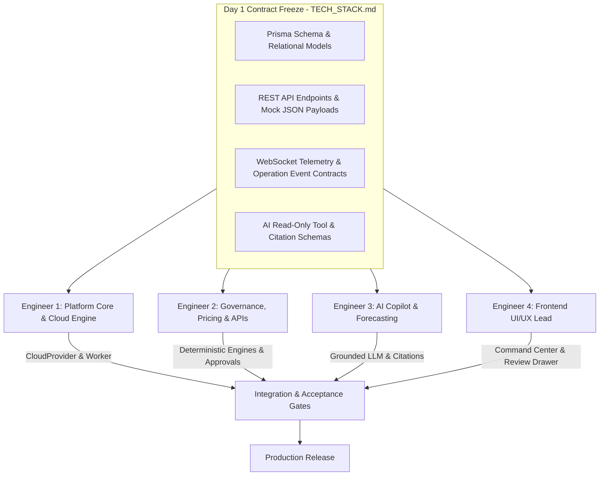
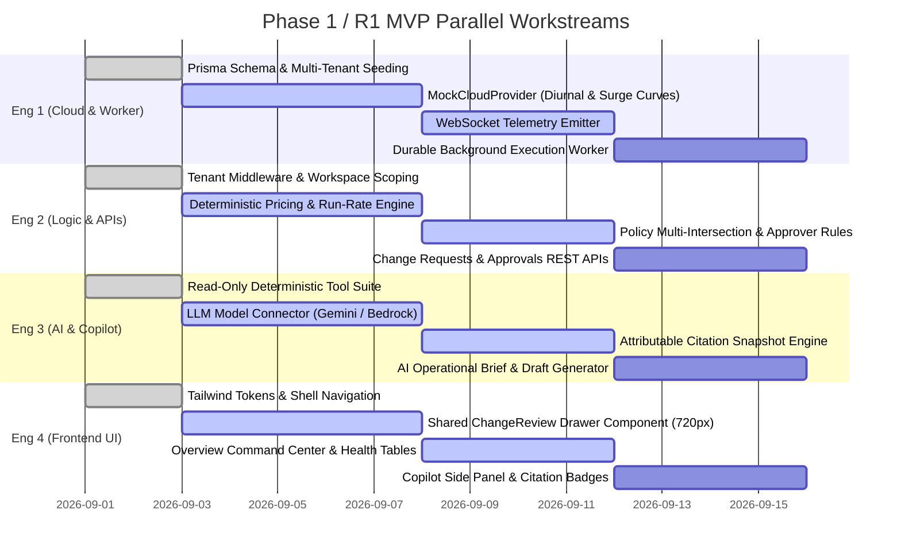
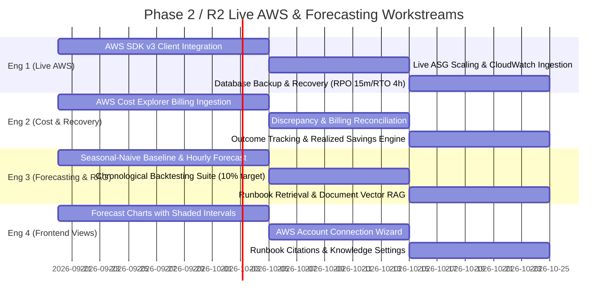

# CloudOps — 4-Person Parallel Implementation Plan

| Field | Value |
| --- | --- |
| Problem Statement | PS-10: Unified Cloud Resource, Scaling & Cost Management Platform |
| Architecture Baseline | [TECH_STACK.md](TECH_STACK.md) |
| Product Contract | [PRD.md](PRD.md) |
| Design Contract | [DESIGN.md](DESIGN.md) |
| Target Releases | R1 (AI-Assisted MVP) → R2 (Live AWS & Forecasting) → R3 (Multi-Cloud & Automation) |
| Parallel Team Size | 4 Full-Stack / Specialized Engineers |

---

## 1. Executive Strategy: Contract-First Zero-Wait Architecture

To ensure 4 engineers work concurrently with **zero blocking dependencies**, the engineering roadmap is organized around a **Contract-First Architecture**:

1. **Pre-Agreed Interface Boundaries**: All database schemas (`schema.prisma`), REST API contracts, and WebSocket event payloads are pre-frozen in [TECH_STACK.md](TECH_STACK.md).
2. **Decoupled File Ownership**: Each engineer owns distinct file trees. Shared files (like `routes/index.js`) are modified via isolated route mounts.
3. **Mock-Driven Frontend Autonomy**: Engineer 4 (Frontend) builds screens immediately against mock JSON contracts without waiting for backend implementations.
4. **Isolated Vertical Demonstrations**: Work progresses along vertical acceptance journeys (Journeys A through E) to ensure testable gates at every sprint.

---

## 2. Team Roles & Ownership Matrix

| Engineer | Specialization | Primary Subsystems & Directories Owned |
| :--- | :--- | :--- |
| **Engineer 1 (Platform & Cloud)** | Cloud Engine, Infrastructure Abstraction, Telemetry & Worker | `server/src/providers/`, `server/src/services/workerService.js`, `server/src/services/socketService.js`, Prisma migrations, multi-cloud simulation. |
| **Engineer 2 (Governance & Logic)** | Deterministic Engines, Pricing, Policies, Approvals & REST APIs | `server/src/services/scalingEngine.js`, `server/src/controllers/` (`changeController`, `policyController`, `costController`, `serviceController`), tenant middleware, audit logs. |
| **Engineer 3 (AI & Forecasting)** | AI Copilot, Attributable Citations, Statistical Baselines & RAG | `server/src/services/copilotService.js`, `server/src/controllers/copilotController.js`, Gemini/Bedrock integration, seasonal-naive forecasts, backtesting suite. |
| **Engineer 4 (Frontend Lead)** | Enterprise Design System, Command Center, Review Drawer & Copilot UI | `client/src/` (Tailwind tokens, React components, `ChangeReview.jsx`, `CopilotPanel.jsx`, `Dashboard.jsx`, `Changes.jsx`, Recharts visualizations). |

---

## 3. Sprint-by-Sprint Work Breakdown Structure (WBS)

### Phase 1: Contract Alignment & Core MVP (Release R1)
*Goal: Complete Journeys A–D end-to-end: Traffic surge detection, AI explanation, Two-Person approval, durable worker reconciliation, and audit trail.*

---

### Detailed Task Assignments for Phase 1 (R1 MVP)

#### Engineer 1: Platform Core, Cloud Engine & Worker
* **Task 1.1**: Deploy Prisma schema for multi-tenancy (`Workspace`, `Service`, `Resource`, `Metric`, `ChangeOperation`).
* **Task 1.2**: Implement `MockCloudProvider.js`:
  * Generate diurnal base telemetry across AWS, Azure, and GCP.
  * Inject repeatable Journey A surge scenario (+34% traffic, 82% CPU on `Production API` / `api-asg`).
* **Task 1.3**: Implement WebSocket live streaming via `socketService.js`:
  * Room multiplexing by workspace (`workspace:${id}:metrics`).
  * 10-second sample broadcasting with packet payload validation.
* **Task 1.4**: Implement `workerService.js`:
  * Asynchronous queue processing with unique `idempotencyKey` values.
  * State progression: `QUEUED` → `RUNNING` → `RECONCILING` → `SUCCEEDED`/`FAILED`.
  * Automatic rollback handling on simulated provider timeout.
* **Task 1.5**: Author provider integration unit tests.

#### Engineer 2: Governance, Deterministic Pricing & REST APIs
* **Task 2.1**: Implement `tenantMiddleware.js` for workspace authorization and header/JWT resolution.
* **Task 2.2**: Implement `scalingEngine.js`:
  * Capacity formula: `ceil(currentReplicas * observedCpu / targetCpu)`.
  * 730-hour monthly run-rate and 365-hour remaining period incremental cost calculation.
  * Multi-policy intersection (strictest min/max, lowest step limit, longest cooldown).
  * Two-Person Rule enforcement (`requireSeparateAdmin` blocks requester self-approval).
* **Task 2.3**: Build `changeController.js` and `changeRoutes.js`:
  * `POST /api/changes/preview` (5m validity countdown).
  * `POST /api/changes/submit` (generates request and queues operation).
  * `POST /api/changes/:id/approve` (validates role and blocks self-approval).
  * `POST /api/changes/:id/reject` (captures operational reason).
  * `GET /api/changes` (tabs: Needs Approval, In Progress, History).
* **Task 2.4**: Implement `costController.js`, `policyController.js`, and `serviceController.js`.
* **Task 2.5**: Maintain and expand automated API test suite (`test_apis.js`).

#### Engineer 3: AI Intelligence, Copilot Tools & Citations
* **Task 3.1**: Implement deterministic tool suite in `copilotService.js`:
  * `get_service_metrics(serviceName, windowMinutes)`
  * `get_cost_breakdown(timeRange, groupBy)`
  * `preview_scaling_impact(resourceId, proposedCapacity)`
* **Task 3.2**: Implement LLM integration with Google Gemini / OpenAI:
  * Strict function-calling declarations (JSON schemas).
  * Grounded system prompt enforcing plain-language evidence citations.
* **Task 3.3**: Build Citation Resolver:
  * Store immutable snapshot in `CopilotCitation` table.
  * Bind citation badges `[1]`, `[2]` to exact metric windows and pricing records.
* **Task 3.4**: Implement structured Change Draft card generation:
  * Produce non-executing draft JSON payloads for handoff to frontend review drawer.
* **Task 3.5**: Build `copilotController.js` endpoints (`/chat`, `/threads`, `/brief`, `/feedback`).
* **Task 3.6**: Create initial 100-question operational evaluation corpus (numerical accuracy & citation verification).

#### Engineer 4: Frontend Lead, Design System & Workspaces
* **Task 4.1**: Configure [tailwind.config.js](client/tailwind.config.js) with DESIGN.md §2 tokens:
  * Midnight-slate sidebar (`#0F172A`), canvas (`#F8FAFC`), cobalt primary (`#2563EB`), violet AI (`#7C3AED`), and status colors.
  * Typography: Inter + JetBrains Mono.
* **Task 4.2**: Implement application shell and navigation:
  * [Sidebar.jsx](client/src/components/layout/Sidebar.jsx) with 5 IA groups: Operate, Optimize, Control, Intelligence, Workspace.
  * [TopBar.jsx](client/src/components/layout/TopBar.jsx) with data freshness indicator, Ask Copilot trigger, and 1-click role switcher.
  * Workspace routing in [App.jsx](client/src/App.jsx) (`/w/:slug/*`).
* **Task 4.3**: Build [ChangeReview.jsx](client/src/components/changes/ChangeReview.jsx) drawer (680–760px desktop drawer):
  * 4 stages: Proposal → Impact & checks → Submit/approval → Execution & outcome.
  * Before/after run-rate, remaining-period delta, and budget headroom display.
  * Status badges for capacity bounds, cooldown, and Two-Person separate approval notice.
  * 5-minute countdown preview validity timer with refresh action.
* **Task 4.4**: Build [Dashboard.jsx](client/src/pages/Dashboard.jsx) (Command Center Overview):
  * Health attention banner: *"2 services need attention [Investigate]"*.
  * 6 KPI cards with tabular JetBrains Mono numerals.
  * AI operational brief with citation links.
  * Priority recommendations table with [Review Change] drawer launcher.
  * Service health table (Healthy, Warning, Critical, Unknown).
* **Task 4.5**: Build [CopilotPanel.jsx](client/src/components/copilot/CopilotPanel.jsx) & [Copilot.jsx](client/src/pages/Copilot.jsx):
  * Side panel & full workspace.
  * Clickable citation badges `[1]`, `[2]` opening evidence inspector.
  * Structured draft cards with "Review draft" handoff to `ChangeReview`.
* **Task 4.6**: Build [Changes.jsx](client/src/pages/Changes.jsx) (Needs Approval, In Progress, History).
* **Task 4.7**: Verify responsive viewports (360px, 768px, 1280px, 1536px) and WCAG 2.2 AA accessibility.

---

### Phase 2: Live AWS Beta & Predictive Insights (Release R2)

#### Detailed Task Assignments for Phase 2 (R2)
* **Engineer 1**:
  * Implement `AWSCloudProvider.js` using `@aws-sdk/client-auto-scaling` and `@aws-sdk/client-cloudwatch`.
  * Support STS AssumeRole credentials for multi-account management.
  * Conduct disaster recovery drill demonstrating database RPO $\le 15$ min and RTO $\le 4$ hours.
* **Engineer 2**:
  * Ingest amortized daily costs via `@aws-sdk/client-cost-explorer`.
  * Build billing reconciliation comparing catalog estimates against provider-finalized billing.
  * Implement post-change outcome measurement comparing pre/post utilization windows.
* **Engineer 3**:
  * Build 24-hour and 7-day demand forecasting service using 28-day historical hourly data.
  * Implement chronological backtesting validation (model must improve on baseline error by $\ge 10\%$).
  * Build runbook indexing engine with document version citations.
* **Engineer 4**:
  * Build Forecast charts in `Monitoring.jsx` with median trendlines and shaded prediction intervals.
  * Implement Cloud Connection Wizard in `Settings.jsx` with live validation status checks.
  * Build Runbook & Knowledge management tab in `Settings.jsx`.

---

### Phase 3: Multi-Cloud & Bounded Automation (Release R3)

#### Detailed Task Assignments for Phase 3 (R3)
* **Engineer 1**: Implement `AzureCloudProvider.js` (VMSS, Azure Monitor) and `GCPCloudProvider.js` (MIG, Cloud Monitoring).
* **Engineer 2**: Build cross-cloud cost arbitrage engine and policy-authorized scheduled scaling.
* **Engineer 3**: Implement statistical anomaly correlation linking metric spikes to deployment events.
* **Engineer 4**: Build multi-cloud comparison dashboards and automation policy toggles.

---

## 4. End-to-End Acceptance Journey Verification

All 4 engineers must validate their work against the formal acceptance journeys defined in [PRD.md §8](PRD.md):

| Journey | Description | Responsible Engineers | Verification Gate |
| :--- | :--- | :--- | :--- |
| **Journey A** | Traffic surge (+34%), AI explanation, approved scaling (4 → 6 replicas), Two-Person approval rule. | Eng 1 (Surge Telemetry), Eng 2 (Pricing), Eng 3 (Citations), Eng 4 (Review Drawer) | Requester self-approval is blocked; separate Admin approves; worker reconciles 6 replicas; audit log verified. |
| **Journey B** | Cost investigation and non-overlapping optimization savings. | Eng 2 (Cost Breakdown), Eng 3 (Copilot explanation), Eng 4 (Cost Workspace) | Deduplicated savings correctly calculated; Copilot cites verified cost records. |
| **Journey C** | Permission, budget, and AI failure paths. | Eng 2 (Budget guardrail), Eng 3 (Quota limits), Eng 4 (Error UI) | Viewers cannot submit changes; budget overage displays hard block; AI timeout gracefully degrades. |
| **Journey D** | Stale evidence and ambiguous provider timeouts. | Eng 1 (Worker reconciliation), Eng 2 (Idempotency), Eng 4 (Timeline UI) | Provider timeout enters `RECONCILING`; polling confirms actual state before retry; no duplicate mutations. |
| **Journey E** | Forecast-assisted planning with backtested model (R2). | Eng 3 (Forecasting model), Eng 4 (Forecast Chart UI) | Model demonstrates $\ge 10\%$ holdout improvement; pre-peak change proposal enters standard review drawer. |

---

## 5. Daily Sync & Conflict Prevention Protocols

1. **Branching Strategy**:
   - `main`: Protected production branch; requires passing CI/CD.
   - `develop`: Shared integration branch.
   - `feat/eng1-cloud-worker`, `feat/eng2-governance-apis`, `feat/eng3-ai-copilot`, `feat/eng4-frontend-shell`.
2. **Contract Preservation**:
   - No engineer may alter `schema.prisma`, API routes, or WebSocket packet signatures without a joint review.
3. **Automated Continuous Integration**:
   - Every pull request runs:
     1. `npm test` across backend and client.
     2. `node test_apis.js` (11 contract test assertions).
     3. `npm run build` on Vite client.
4. **Daily Contract Standup**:
   - Daily 15-minute sync focusing exclusively on interface friction, payload contracts, and integration milestones.
