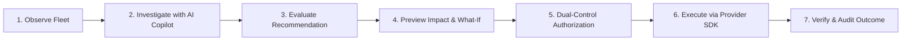

# CloudOps — AI-Assisted Multi-Cloud Operations, Scaling & Cost Governance Workspace

[](https://nodejs.org)
[](https://react.dev)
[](https://vitejs.dev)
[](https://tailwindcss.com)
[](https://prisma.io)
[](https://aws.amazon.com)

**CloudOps** is a unified, AI-assisted cloud operations platform designed for engineering, product, and FinOps teams. It turns complex multi-cloud telemetry into understandable, cost-aware, policy-governed, and authorized action.

Instead of jumping between disconnected AWS, Azure, and GCP management consoles, CloudOps delivers a single pane of glass for monitoring infrastructure health, querying real-time telemetry, conversing with a grounded AI Copilot, previewing cost and capacity changes with pre-flight simulations, and executing policy-bounded scaling actions.

---

## 🧭 Core Product Workflow

CloudOps is engineered around the human-in-the-loop operational lifecycle:



---

## 🌟 Key Capabilities & Modules

### 1. 🎛️ Command Center Dashboard (`/dashboard`)
- **Global Health Banner**: Instant status assessment displaying service counts, healthy vs degraded states, and immediate call-to-actions for workloads requiring attention.
- **6 Enterprise KPI Metrics**: Active Workloads, 24h Request Volume, Average Fleet Latency, 30-Day Uptime SLA, Monthly Run-Rate, and Potential Rightsizing Savings.
- **Traffic & Performance Telemetry**: Combined dual-axis Recharts area & line visualization for Request Volume and Latency (ms) across `1H`, `6H`, `24H`, `7D`, and `30D` windows.
- **Fleet-Wide Resource Utilization**: Horizontal progress indicators for CPU, Memory, Storage, and Network bandwidth.
- **24-Workload Health Matrix**: Granular inventory table with CPU, Memory, Latency, and Monthly Cost metrics.
- **Financial & Provider Breakdowns**: 6-month spending trajectory against budgets, alongside AWS, Azure, and GCP resource/cost distribution donut charts.
- **Needs Attention & Live Activity Stream**: Priority operational alerts alongside an immutable audit trail.

### 2. 🤖 AI Operations Copilot (`/copilot`, `CopilotPanel`)
- **Attributable & Grounded Reasoning**: Answers complex infrastructure, incident, and financial queries using cited workspace data and internal runbooks.
- **Security & Safety Guardrails**: Built-in prompt injection sanitization, workspace data isolation, and read-only query bounds.
- **Session Thread Persistence**: Multi-threaded conversational history with token tracking and workspace AI budget limits.

### 3. ⚡ Autonomous Scaling & Rightsizing Engine (`/scaling`)
- **Intelligent Heuristics**: Evaluates 7-day workload patterns, diurnal surges, and memory saturation to detect under- and over-provisioning.
- **Explainable Recommendations**: Clear rationale, confidence scores (e.g., 94%), current vs target capacity, and exact monthly cost delta projections (+₹/-₹).
- **1-Click Execution**: Direct scaling trigger with policy validation and permission checks.

### 4. 📋 Change Review & Dual-Control Approvals (`/changes`)
- **Pre-Flight What-If Simulation**: Model capacity adjustments and cost changes before executing against cloud providers.
- **Governance Gate**: Policy threshold verification with automatic approval requirement routing for high-impact or budget-exceeding changes.
- **Durable Worker Reconciliation**: State-machine execution tracking with automatic failure reconciliation and audit logging.

### 5. 💰 Multi-Cloud Cost Governance & FinOps (`/costs`)
- **Cross-Cloud Financial Analytics**: Aggregated 30-day daily spend across AWS, Azure, and GCP.
- **Budget Guardrails**: Threshold alerts and projected end-of-month spend forecasting.
- **Currency Support**: Formatted with standard Indian Rupee (`₹`) and USD (`$`) numbering conventions.

### 6. 🛡️ Governance Policies & Quotas (`/policies`)
- **Capacity & Budget Guardrails**: Enforce maximum instance counts, monthly cost caps, and mandatory approval gates across environments.
- **Role-Based Enforcement**: Admin-controlled policy toggling and rule creation.

### 7. 📜 Enterprise Security & Audit Trail (`/audit-logs`)
- **Immutable Log Stream**: User/actor attribution, timestamps, action categories (`SCALE_RESOURCE`, `TOGGLE_POLICY`, `USER_LOGIN`), and inspectable JSON payloads.

---

## 🏛️ Architecture & Multi-Cloud Provider Abstraction

CloudOps is architected with a decoupled provider layer adhering to the `CloudProvider` base interface:

```
CloudOps/
├── client/                     # Frontend (React 18, Vite, Tailwind CSS, Recharts)
│   ├── src/
│   │   ├── components/
│   │   │   ├── common/         # Button, Card, Badge, Modal, Input, Select, StatCard, Skeleton
│   │   │   ├── charts/         # TrafficPerformanceChart, MonthlyCostChart, ProviderDistributionChart, etc.
│   │   │   ├── changes/        # ChangeReview, PreFlightSimulation
│   │   │   ├── copilot/        # CopilotPanel, MessageThread, Citations
│   │   │   ├── resources/      # ScaleResourceModal, ResourceDetailModal
│   │   │   └── layout/         # Sidebar, TopBar, DashboardLayout
│   │   ├── pages/              # Dashboard, Resources, ResourceDetail, Monitoring, Scaling,
│   │   │                       # Changes, Costs, Policies, Copilot, AuditLogs, Settings, Login, Register
│   │   ├── layouts/            # DashboardLayout (Protected shell with workspace routing)
│   │   ├── hooks/              # useAuth, useCloudFilter, useSocket
│   │   ├── services/           # Axios API services with JWT auto-injection
│   │   └── utils/              # Formatters, constants, role configs
│   ├── index.html
│   ├── tailwind.config.js
│   └── vite.config.js
│
└── server/                     # Backend (Node.js, Express, Socket.IO, Prisma ORM, SQLite)
    ├── prisma/
    │   ├── schema.prisma       # Relational multi-tenant schema (Workspaces, Services, Changes, Copilot, etc.)
    │   ├── seed.js             # Multi-cloud demo seed (24 resources, 1700+ metrics, 6-mo costs)
    │   └── dev.db              # SQLite database file
    ├── src/
    │   ├── controllers/        # Dashboard, Change, Copilot, Service, Resource, Metric, Scaling, Cost, Policy, Audit
    │   ├── routes/             # REST API endpoints mounted under /api/*
    │   ├── services/           # copilotService, scalingEngine, workerService, socketService
    │   ├── middleware/         # authMiddleware, roleMiddleware, tenantMiddleware, errorMiddleware
    │   ├── models/             # Prisma client instance
    │   ├── providers/          # Pluggable Multi-Cloud Provider Abstraction
    │   │   ├── CloudProvider.js      # Base interface specification
    │   │   ├── MockCloudProvider.js  # Realistic multi-cloud simulation engine
    │   │   ├── AWSCloudProvider.js   # Real AWS SDK v3 (EC2, CloudWatch, Auto Scaling, STS Assume-Role)
    │   │   ├── AzureCloudProvider.js # Real Azure SDK (ARM Compute, Azure Monitor, Consumption)
    │   │   └── GCPCloudProvider.js   # Real GCP SDK (Compute Engine, Cloud Monitoring, Cloud Billing)
    │   ├── utils/              # JWT, Logger, helpers
    │   ├── app.js              # Express app configuration
    │   └── server.js           # HTTP + WebSocket Server Entrypoint
    ├── scripts/
    │   └── backup_db.sh        # Disaster recovery database snapshot script
    ├── restore_validate.js     # Automated backup restore validation suite
    ├── test_apis.js            # Comprehensive REST API verification suite
    ├── test_multicloud.js      # Multi-cloud provider adapter test suite
    └── test_aws_provider.js    # AWS live SDK assume-role test suite
```

---

## 👥 Demo User Accounts & Access Control

The platform features built-in demo accounts with **1-Click Login** on the login screen:

| Role | Email | Password | Permissions |
| :--- | :--- | :--- | :--- |
| **ADMIN** | `admin@cloudops.dev` | `cloudops123` | Full control: Approve change requests, manage policies, connect accounts, scale workloads, configure AI. |
| **OPERATOR** | `operator@cloudops.dev` | `cloudops123` | Operational control: Submit change requests, apply scaling within policy limits, restart workloads, use Copilot. |
| **VIEWER** | `viewer@cloudops.dev` | `cloudops123` | Read-only access: View dashboards, telemetry, cost reports, and ask Copilot questions. |

*You can switch roles on the fly using the **"Switch Role"** menu in the top navigation bar.*

---

## 🚀 Quick Start Guide

### 1. Prerequisites
- **Node.js**: v18.0.0 or higher
- **npm**: v9.0.0 or higher

---

### 2. Backend Setup

```bash
# Navigate to the server directory
cd server

# 1. Install dependencies
npm install

# 2. Synchronize database schema
npx prisma db push

# 3. Seed database with 24 multi-cloud resources, metrics, 6-month costs & recommendations
node prisma/seed.js

# 4. (Optional) Run automated test verification
node test_apis.js
node test_multicloud.js

# 5. Start backend server
npm start
# -> Backend runs on http://localhost:5000 (REST APIs & WebSocket)
```

---

### 3. Frontend Setup

```bash
# In a new terminal window, navigate to the client directory
cd client

# 1. Install dependencies
npm install

# 2. Start Vite development server
npm run dev
# -> Frontend runs on http://localhost:5173
```

Open **`http://localhost:5173`** in your browser and click any of the 1-Click Demo Logins to explore!

---

## 🌐 Complete REST API Reference

All protected endpoints require the `Authorization: Bearer <JWT_TOKEN>` header.

### 🔐 Authentication & Session
- `POST /api/auth/login` — Sign in with email and password
- `POST /api/auth/register` — Register a new account with role assignment
- `GET /api/auth/me` — Get current user session and workspace membership
- `GET /api/auth/demo-accounts` — List pre-seeded demo accounts

### 🎛️ Command Center Dashboard
- `GET /api/dashboard/summary` — 6 KPI cards, global health status, and utilization stats
- `GET /api/dashboard/traffic?timeRange=24H` — Historical requests and latency time series
- `GET /api/dashboard/resource-health` — 24-workload status, CPU %, Memory %, and Latency
- `GET /api/dashboard/cost-overview` — Current spend, projection, budget, and 6-month history
- `GET /api/dashboard/provider-distribution` — Multi-cloud resource count & cost split
- `GET /api/dashboard/recommendations` — Active scaling recommendations
- `GET /api/dashboard/activity` — Recent activity feed from audit logs
- `GET /api/dashboard/alerts` — High-priority operational alerts

### 📋 Change Management & Approvals
- `GET /api/changes` — List change requests (pending, approved, executed)
- `POST /api/changes` — Submit a change request (*Requires Operator or Admin*)
- `POST /api/changes/:id/review` — Run pre-flight what-if simulation & policy check
- `POST /api/changes/:id/approve` — Approve change request (*Requires Admin*)
- `POST /api/changes/:id/reject` — Reject change request (*Requires Admin*)
- `POST /api/changes/:id/execute` — Execute change via cloud provider adapter

### 🤖 AI Copilot
- `GET /api/copilot/threads` — List conversation threads for current workspace
- `POST /api/copilot/threads` — Create a new Copilot thread
- `POST /api/copilot/message` — Send a message and receive grounded AI response with citations

### 📦 Services & Workloads
- `GET /api/services` — List logical application services
- `GET /api/resources` — List multi-cloud resources with filtering (`provider`, `region`, `status`)
- `GET /api/resources/:id` — Get single resource specifications and 24h telemetry
- `POST /api/resources/:id/scale` — Adjust capacity (*Requires Operator or Admin*)
- `POST /api/resources/:id/restart` — Restart workload (*Requires Operator or Admin*)

### 📊 Metrics & Telemetry
- `GET /api/metrics/aggregated` — Fleet-wide CPU, Memory, Latency, and Requests timeline
- `GET /api/metrics/:resourceId?timeRange=24h` — Time-series metrics for specific resource

### ⚡ Autonomous Scaling
- `GET /api/scaling/recommendations` — List pending rightsizing & scale recommendations
- `POST /api/scaling/apply/:id` — Apply recommendation (*Requires Operator or Admin*)
- `POST /api/scaling/dismiss/:id` — Dismiss recommendation

### 💰 Cost Governance
- `GET /api/costs/summary` — Monthly run-rate, projected spend, and breakdown
- `GET /api/costs/records` — Raw billing logs from connected accounts

### 🛡️ Policies & Guardrails
- `GET /api/policies` — List governance policies
- `PATCH /api/policies/:id/toggle` — Toggle policy active status (*Requires Admin*)
- `POST /api/policies` — Create governance policy (*Requires Admin*)
- `PUT /api/policies/:id` — Update governance policy (*Requires Admin*)
- `DELETE /api/policies/:id` — Delete governance policy (*Requires Admin*)

### 📜 Security & Audit Logs
- `GET /api/audit-logs` — Immutable audit trail with actor attribution

### ☁️ Cloud Accounts
- `GET /api/accounts` — List connected cloud accounts (AWS, Azure, GCP)
- `POST /api/accounts/:id/sync` — Sync account connector status

---

## 🛡️ Disaster Recovery & Backup Verification

CloudOps includes automated database snapshot and restore validation utilities:

```bash
# 1. Create a timestamped, checksummed database backup
bash scripts/backup_db.sh

# 2. Run automated restore verification & integrity validation
node server/restore_validate.js
```

---

## 📚 Companion Documentation

For in-depth technical specifications and design guidelines, consult:
- **[Product Requirements Document (PRD.md)](PRD.md)** — Core problem statement, personas, permission matrix, and release criteria.
- **[Frontend Design Specification (DESIGN.md)](DESIGN.md)** — Design tokens, component rules, accessibility standards, and page layouts.
- **[Technology Stack & Architecture (TECH_STACK.md)](TECH_STACK.md)** — Architectural patterns, multi-cloud SDK contracts, Copilot integration, and schema definitions.
- **[Implementation Plan (IMPLEMENTATION_PLAN.md)](IMPLEMENTATION_PLAN.md)** — Release milestones, acceptance checklists, and testing plans.
- **[Disaster Recovery Playbook (DR_PLAYBOOK.md)](DR_PLAYBOOK.md)** — Backup procedures, RPO/RTO targets, failure modes, and recovery drills.

---

## 📄 License
This project is licensed under the [MIT License](LICENSE).
